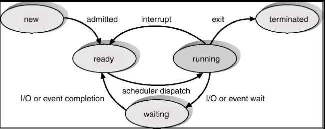

# Process
- 이전에 설명했던 것과 같이 실행가능한 프로그램이다.

### process의 주기
- new : process가 생성된 직후 단계이다.
- ready : process가 CPU에 할당되기를 기다리는 상태로 실행될 준비가 완료되어 있다.  
즉 ready queue에 process가 할당되어 있는 상태이다.
- running : 현재 process가 실행되어지고 있는 상태이다.
- waiting : event(특정 처리가 완료되어 오는 신호)가 발생하기를 기다리는 상태이다.
- terminated : process의 실행이 종료되었을 때를 의미한다.

- asleep state : memory에 올라갔지만, 사용이 없어서 잠시 storage로 귀양간 상태이다.
  해당 process를 다시 불러오는 것은 Swap in , 보내는 것을 Swap out이라 한다.
- Zombie state : terminated 이지만, 삭제되지 않은 process이다.

### PCB(Process Control Block)
- process의 정보를 담는 block이다.
- PCB가 만들어진 순간 program이 process가 된다.
- OS는 PCB의 정보를 옮기고 이를 갖고 각종 처리와 저장을 수행한다.
- 포함되는 정보는 다음과 같다.
  - process state
  - PC(program count)
  - CPU registers
  - CPU Scheduling information
  - Memory-management information
  - Accounting information
  - I/O status information
  - process file table
  - 등 등

### Context Switching
- CPU의 처리 process가 다른 process로 바뀌는 것을 말한다.
- 사람에 비유하자면 사람도 문맥을 알아야 상황을 이해하고 올바른 행동을 할 수 있듯이,  
컴퓨터도 새로운 상황에서 새로운 문맥을 불러오는 과정이 필요한 것이다.
- 즉, 처리 process를 바꾸기 위해서는 불러오는 process의 정보를 읽기 위해  
원래 처리 process의 정보를 다시 PCB에 저장하고,  
처리하고자하는 process의 정보를 불러오는 과정이 필요하다.
- 따라서, Context Switching에 의한 cost는 온전히 overhead가 된다. 즉, 원하지 않는 비용이다.

### Scheduler
- 어떻게 process를 CPU에 올릴 것인지를 결정하는 장치

##### process Scheduling queue
- Job Queue : process를 storage에서 memory로 할당하는 Queue.
- Ready Queue : process를 CPU에 할당하는 Queue.
- Waiting queue : 특정 event가 발생하기를 기다리는 Queue.
- Device Queue : I/O device의 입력을 기다리는 Queue. (Wating queue에 속한다.)

##### scheduler의 종류
- Job Scheduler (Long term Scheduler) : Storage와 Job queue, Job queue와 Memory 사이에서  
값을 할당하는 scheduler.  
빈번한 데이터 요청과 할당은 없지만, multiprogramming의 정도를 판단하는 중요한 역할을 한다.
- CPU Scheduler (Short term Scheduler) : memory와 Ready queue, Ready queue와 CPU 사이에서  
값을 할당하는 scheduler.
- Mid term Scheduler : swap out과 swap in을 관리하며 해당 process를 Memory로 불러오는 scheduler.  
UNIX WINDOWS는 Long term scheduler가 없어서 이를 통해 scheduling을 수행한다.  
매우 빈번하게 자료 변화가 발생하고 이를 처리하기 위해 굉장히 빨라야한다.

##### Scheduler의 기준
- CPU 활용성
- Throughput : 처리 효율
- Turnaround time : 총 시간
- Wating time : 대기 시간
- Response time : 입력을 받고 응답을 보내는 시간. (output을 내는 것이 아님.)

### Process creation
- process의 생성은 fork라는 방식으로 이루어진다.(UNIX 한정)
- 이를 통해서 수행을 하게 되면, 모든 process는 tree 구조를 갖게 된다.
- 이들간에 resource sharing, time sharing을 긴밀하게 조율해주어야 한다.

##### Fork
- process 하나를 복사하여 다른 process를 생성하는 system call이다.
- fork는 진짜 우리가 식사를 할 때, 사용하는 그 fork에서 유래되었다.
- 왜냐하면 fork 시에 하나의 process가 tree처럼 확갈라지면서 fork의 모양처럼 동시에 나아가는 형태로 진행이된다.
- 즉, fork를 하게 되면 서로 다른 process(parent & child)는 동시에 서로 나아가게 된다.
- fork 자체는 새로운 process를 만드는 것인데 아무것도 실행하지 않는 process를 만들 수도 없고,  
이런 식으로 작동하게 된다면 매우 비효율적이미로, 부모를 똑같이 duplication한다.
- 따라서, 부모의 데이터와 코드들을 그대로 사용할 수 있다.

자세한 활용은 Linux System programming의 process&thread 부분을 봐보도록 하자.

##### exec
- 다른 program을 불러와서 실행시키는 system call이다.
- 이를 실행하게 되면 자신의 모든 정보를 포기하고, 해당 program을 실행시키는 process로 변화하게 된다.

##### createProcess
- process를 부모 process의 복사없이 바로 새로운 process를 실행시키는 system call이다.
- 이는 UNIX OS와는 거리가 있는 방식이다.
- UNIX에서는 Fork 하고 Exec하는 방식으로 진행한다.

### Process Termination
- process의 종료는 exit과 abort로 나뉜다.
- exit는 마무리 처리를 해주는 느낌이라면, abort는 강제 종료의 느낌이다.

### Cooperating Process
- process간의 의사소통 방식은 매우 중요하다.
- 이들 간의 영향을 주고받는 것은 자동으로 이루어지지 않는다.
- 따라서, 이를 위한 방법을 제공해주어야 한다.
- 방식은 2가지가 존재한다.(Message Passing vs Shared Memory)

##### Message passing(Direct Communication)
- 직접적으로 두 process가 message를 주고받는 형식이다.
- buffer에 데이터를 쌓고 한 번에 보내는 방식과 제한없이 한 번에 보내는 방식들이 있다.
- 둘 process의 연결이 매우 중요하다.
- 한 번에 전송에서 sender와 receiver의 구분이 명확하다.
- 한 대상과 하나의 연결을 갖고 있고, 여러 process와 연결이 있을 수 있다.

##### Shared memory(Indirect Communication)
- 직접 대상을 지정하지 않고 mail box라는 누구나 접근할 수 있는 shared memory에 데이터를 저장하는 방식이다.
- 각 각의 process는 mail box와만 연결되어있다.
- mail box는 다양한 process와 동시에 연결되어 있다.

##### Synchronization
- message는 block 되었거나, non-block되어 저장된다.
- block이라면 Synchronization을 고려한 설계이고, 그렇지 않으면 이런 것에 개의치 않은 설계이다.
- 이때 lock이 잘못 걸리면 deadlock이 발생해 모든 process가 정지하는 현상이 발생한다.

##### 짜투리
- flush : 쏟다. (data를 더 저장 공간이 큰 장치에게 밀어 넣는 행동)
- spill : 엎지르다 (= flush)

=> 따라서, 두 단어 모두 대게 cpu register에서 memory or memory에서 storage에 데이터를 전송한다는 개념으로 많이 사용된다.
