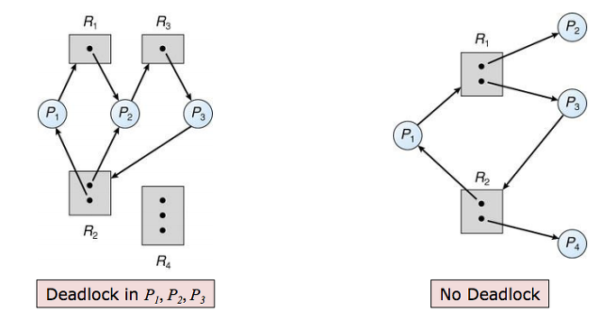

# DeadLocks
- process들이 resource를 갖고서 다른 resource를 기다릴 때 발생한다.
 
(R->P = allocation / P->R = Request)
- DeadLock의 4원칙
  - 이 중에 하나라도 해결한다면 DeadLock은 절대 걸리지 않는다.
    1. Mutual Exclusion : resource에 한 번에 하나의 process만 들어갈 수 있다.
    2. Hold and Wait : resource를 쥔 상태에서 다른 resource를 기다린다.
    3. No preemption : resource를 양보하지 않는다.
    4. Circular wait : 각 process간의 waiting 관계 graph가 circle을 가진다.
- DeadLock의 해결책
  - 1. DeadLock prevetion
    - 요청 방식을 제한한다.
    - 우선 목적이 deadlock의 발생을 막는 것이다.
    - programmer가 직접 구현하는 방식이다.(deadlock 4원칙 중 하나를 없앰으로서 수행한다.)
     가장 일반적인 방식은 Hold and Wait를 없애는 것이다.
  - 2. DeadLock avoidance
    - 어떻게 자원이 요청될지에 대한 추가적인 정보가 필요하다.
    - 요청을 승인할지 그러지 않을지 바로 결정해야 한다.
    - 후에 나올 safe sequence가 만들어지를 판단하고, 그렇지 않다면 process의 자원할당을 보류한다.
    - Safe state
      - 모든 process가 safe sequence로 표현할 수 있을 때, 우리는 system이 safe state에 있다고 한다.
      - process의 실행을 순차적으로 진행했을 때 DeadLock이 `절대` 발생하지 않고 진행할 수 있는 순서도를 safe sequence라고 한다. 
      (unsafe라고 무조건 deadlock인 것은 아니다.)
    - Banker's Algorithm
      - 구조 
      Available(전체 system이 가지고 있는 자원의 수를 의미) 
      Max(각 각의 process가 가질 수 있는 최대 자원의 수를 의미)  Allocation(각 각의 process에 현재 할당된 자원의 수를 의미)  Need(각 각의 process에서 추가적으로 필요로 하는 자원의 수를 의미) = (Max - Allocation)
      - 구현
        - 1. 모든 process의 Need를 파악하고, available보다 낮은 process가 있다면, 해당 process에 자원을 할당한다.
        - 2. 작업이 끝났다면, 해당 process에 할당된 모든 자원을 available로 회수한다.
        - 3. 1, 2 두 작업을 모든 process를 다 할당할 때까지 반복한다.
      - 활용
        - request가 발생할 때마다, 해당 request가 적절한지를 우선 판단한다. 
        available > request
        - request를 해당 process에 할당했을 때 safe sequence가 존재하는지를 판단한다.
      - 복잡도 : O(mn2)  
      m : number of resources types.
      n : number of processes.
      - 다양한 예기치 못한 현상(Resource 소멸, dynamic process situration)이 발생할 수 있기 때문에 banker's Algorithm은 잘 사용하지 않는다.
  - 3. DeadLock detection and recovery
    - system이 DeadLock되는 것을 허락한다. 하지만, 이를 감지하고 회복하는 Algorithm을 통해 이를 해결하는 방식이다.
    - 대게 회복은 해당 process를 종료하거나 resource를 양보하는 식을 수행된다.
  - 4. DeadLock ignorance
    - DeadLock에 대해서 OS는 아무런 책임도 지지않는 형태이다.
    - 이러한 형태를 현대 OS는 대게 취하고 있고, DeadLock의 해결을 application단으로 넘기는 것이다.
