# Memory management
- multi programming 환경에서 memory를 관리하는 것은 여러가지 부분을 신경써주어야 한다.
  - 1. Protection : process가 사용하는 공간을 엄격하게 정하여 다른 process의 동작에 영향을 주거나 받지 않게 하는 것.
  - 2. Fast translation : memory에서 필요로 하는 자원을 빠르게 찾아서 사용하는 것.
  - 3. Fast context switching : memory에 update하는 속도를 빠르게 하는 것.
  - 4. Enable a process althought it is too big : 엄청 나게 큰 process라고 할지라도 이를돌릴 수 있어야 한다. memory보다 process의 어떤 부분을 memory에 올릴 것인가에 대한 것.

### Virtual(logical) Address
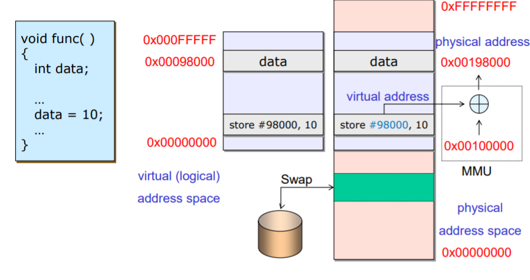

- 실제 data나 instruction을 가르키는 physical address가 아닌 가상의 주소값을 통해서 원하는 위치를 가르키는 방식이다.
- 장점
  - 주소가 짧아짐으로서...
    - 프로그래밍에 있어 추상화를 통해 더 간단하고 편리하게 표현하기 위함.
    - process간의 memory resource 경쟁에서 overhead를 최소화하여 성능을 올리기 위함.
  - 주소가 block 단위로 만들어지며 각 각의 process를 보호/고립시킬 수 있다.
  - time to Bind data from Memory
    - 1. Compile time
      - compile을 통해 program을 physical address에 저장한다.
    - 2. Load time
      - memory에 compile 했던 process를 불러오는 시점이다.
    - 3. Execution time
      - run time까지 binding이 지연되어서, process가 memory 여기저기로 움직일 수 있다.
      - program을 실행시킬 때, virtual address를 통해서 physical address의 접근하는 방식이다.
      - 이럴 경우 hardware와의 mapping이 지원되어야 한다.
      - virtual memory에서 offset을 이용하는 방식이다.

### Dynaminc linking
library와 같은 무거운 instruction, data를 매번 호출할 때마다 memory로 여러 개 올리는 것이 아니라 해당 process가 필요할 때에 이를 올려서 사용하도록하고, 또한, 여러 개의 process가 이를 사용할 수 있도록 한다.

### Overlays
- process의 크기가 memory에 담기에는 너무나 크다면, 이를 필요한 부분만 가져와서 memory에 실어서 사용한다.

### Swapping
- memory의 필요한 자원을 storage로부터 할당하기 위하여 memory에서 temporarily하게 적게 사용된 자원을 storage로 반환하고, memory에 필요한 자원을 불러온다.
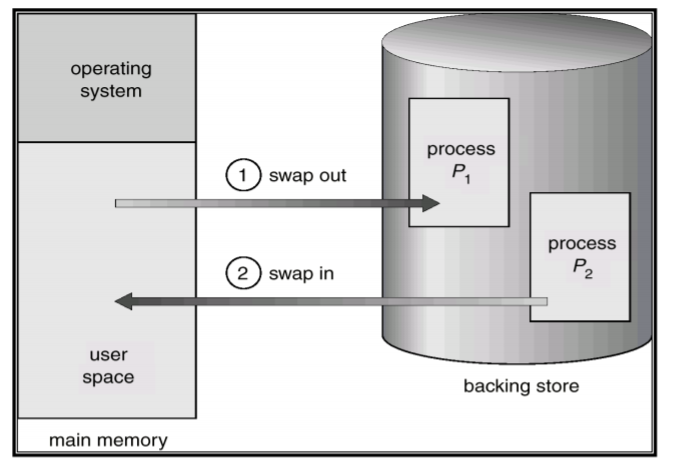

### MMU(Memory Management Unit)
- virtual address를 physical address로 mapping하는 Hardware device이다.
- 정확하게는 virtual address가 들어와서 해당 데이터가 있으면 추가적으로 값을 더해서 내보낸다.
- 이는 후에 page에서 다시 설명.
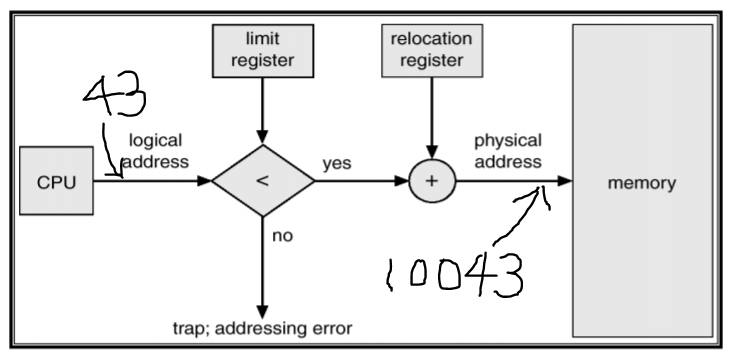

### Memory allocation Protocol
- 1. Contiguous allocation
  - process를 하나의 덩어리로 저장하는 방식이다.
  - memory에 process를 올릴 때 쪼개거나 하지않고 통채로 올리기 때문에 구현이 용이하고 편리하게 사용이 가능하다.
  - 비효율적인 부분이 발생한다.
    - 모든 process를 올려야지 사용이 가능하다.
    - process의 사용이 끝나 해당 영역을 free해주었을 때 빈공간이 발생하게 되고, 이 공간에 적절한 process가 들어가지 않는다면, 공백으로 인한 손해가 발생한다.
    - 이러한 공백으로 인한 문제를 해결하기 위해서 추가적인 logic이 필요하다(compaction)
    - 이러한 현상을 메모리의 단편화 fragmentation이라고 한다.
    - 또한, 이렇게 process 외부에서 발생하는 단편화를 external fragmentation이라고 한다.
  - project 3에서 직접 구현함.
  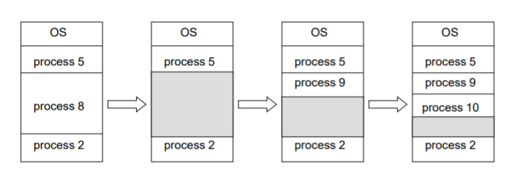

- 2. Paging
  - process가 연속적으로 배치되는 것이 아니라 어디에든지 저장될 수 있다.
  - physical memory를 frame이라는 단위로 쪼갠다.
  - process 또한, page라는 단위로 쪼갠다. 이때 page와 fram의 크기는 동일하다.
  - 이때 process를 정해진 단위로 쪼개다보니 남는 부분이 생기게 되어 internal fragmentation이 발생한다.
  - 또한, logical address에 mapping 되는 physical address를 기록해놓은 page table이 존재한다.
  - 이는 memory에 booting 이후 항시 존재하여 이를 통해 physical address로 번역할 수 있다.
  - 실제 우리 세상에서 제일 많이 쓰이는 방식이다.
    - protection도 자동적으로 수행됨.
    - 복잡한 memory관리에 용이하다.
    - virtual memory를 사용하기에 가장 알맞은 형태이다.  

    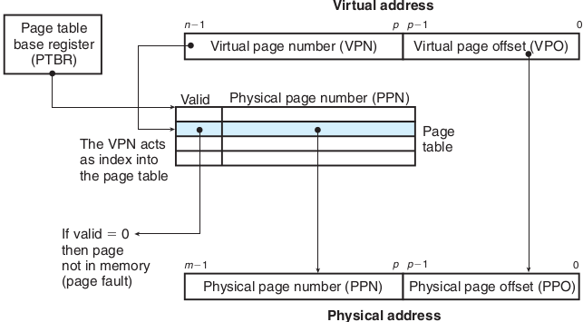  
    page의 크기는 모두 동일하므로 offset은 그대로 이용하여 세부사항을 찾기 용이하다. 
    또한, 그래서 physical page number(value)와 그에 mapping되는 virtual page number(key)만 있으면 된다. 
    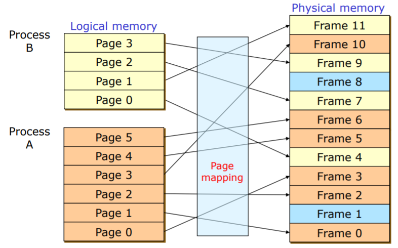
- 3. Segmentation
  - process를 관련된 영역끼리 묶어서 한 번에 저장하는 방식이다.
  - 예를 들어 stack 같이 흩어져있으면 손해를 크게보는 경우에 자주 사용된다.
- 4. Paging with Segmentation
  - paging을 구현하되 segmentation을 보장할 수 있도록 구현하는 방식이다.
  - 좀 더 보완된 방식이지만, 더 어려운 요구사항을 필요로 한다.

### TLB (Table Lookaside Buffer)
- paging을 통해 memory access를 구현하게 되면 한 번 memory에 access할 때 결론적으로 2번의 접근이 필요하다.(page table이 memory에 있기 때문에)
- TLB는 이를 해소한다. 다음과 같이 자주 사용되는 page와 frame number를 mapping한 정보를 buffer에 저장한다.
- 이때 이 hardware 장비를 검색하는 시간은 하나를 검색하는 시간과 동일하다. 모든 장치에 logical address의 page number 값을 입력하고 저장된 page number와 AND연산을 수행한다. 그리고 hit가 발생하면 cpu에게 physical address를 전달하여 비약적인 속도 향상을 볼 수 있다.
- TLB는 MMU에 의해서 관리된다.
- TLB는 locality에 맞게 address data를 넣고 뺀다.
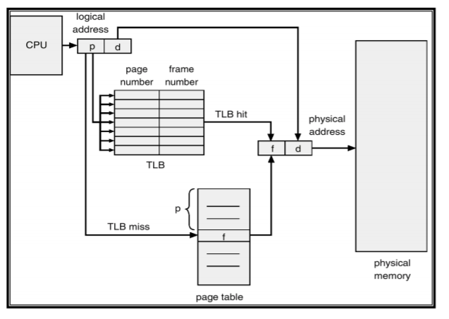

- 그림 때문에 헷갈릴 수 있는데 실제로는 CPU가 MMU에 의뢰하고 MMU에서 위의 과정을 수행한다.

### page table
- process 하나 당 하나의 page table을 갖는다. 
따라서, 모든 process가 마치 0번 주소부터 끝까지 모든 주소를 쓸 수 있는 것처럼 느낄 수 있다.
- 일단 실제로 logical address는 physical address의 index를 의미한다.
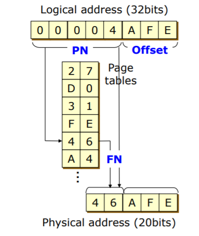  
- 위에서는 상위 5BIT를 빼고 생각한 형태이다.
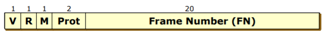  
- page table의 한줄(PTE)은 다음과 같다.
- V(valid bit) : 실제 memory에 page가 존재하는지를 표시한다.(storage에 있을 수도 있다.)
- R(reference bit) : swapping 시에 참고하는 bit이다. 만약, 0이면 교체 대상이된다. 
만약, 해당 page를 사용했다면 1로 checking한다.
- M(modify bit) : TLB에 바로 연결된 Cache에 내용이 변화된 경우를 표시하는 bit이다. 
dirty bit라고도 한다.
- Prot(Protection) : 해당 데이터의 권한을 표시하는 bit이다. 2bit이다.  
(READ, WRITE, EXE, 등)
- page table이 너무 많아 오히려 발생하는 overhead를 관리해줘야 한다.
  - page table을 관리하기 위한 다양한 방법이 존재한다.
    - hierarchical page table : address를 더 세부적으로 쪼개어 계층적으로 관리하는 구조이다.
    - two level page table : page table의 table을 두고 이를 통해 page table에 접근하는 방식이다.
    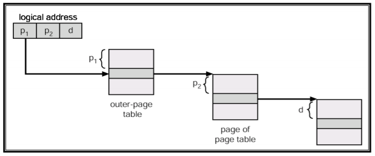  
    - hashed page table : virtual address를 hashing하여 chain hash table에 저장하는 방식이다.
    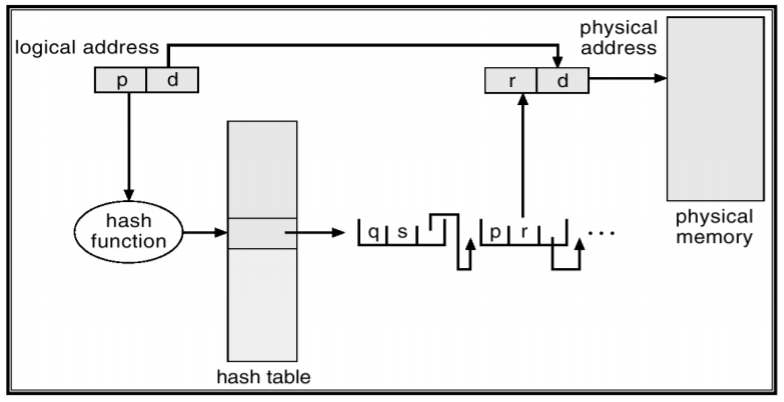  
    - clustered page table : hashed와 유사한 개념이지만, chaining을 사용하지 않고 virtual address에 중복될 경우의 몇 번째 hash값인가에 대한 정보를 별도로 저장하는 방식이다.
    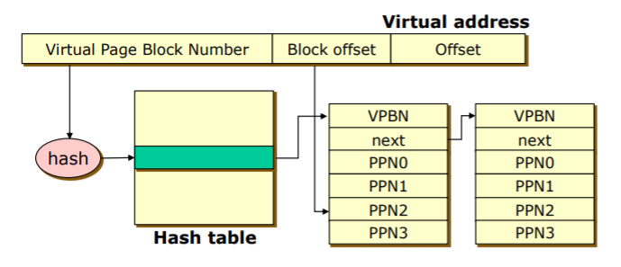  
    - inverted page table : process id를 포함하여 table을 찾는 방식이다.
    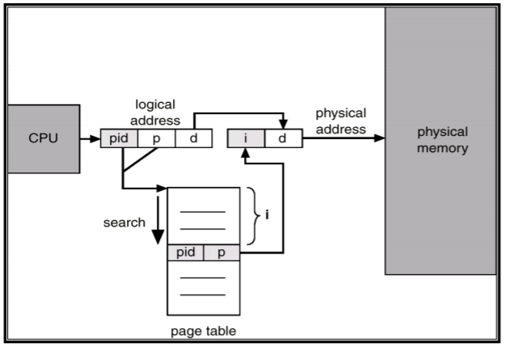  
    - shared page : 여러 process들이 공통으로 자주 사용하는 process의 code를 각 각의 process가 전역값으로 갖고 있는 형태이다.(stdin, stdout, stderr)
    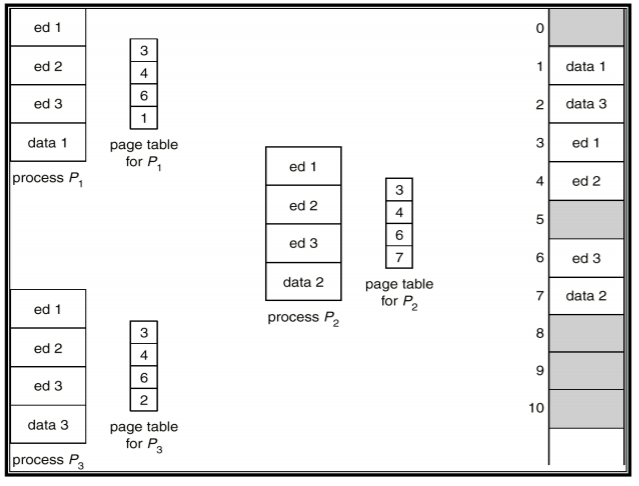

### paging summary
- 장점
  - external fragmentation이 존재하지 않는다.
  - 할당과 해제가 매우쉽다.(page in, out)
  - memory의 데이터를 보호하기 쉽다.
  - page를 공유하기도 쉽다.
- 단점
  - internal fregmentation이 존재한다.
  - memory값을 불러오는데 2번의 memory의 access가 필요하다.(TLB로 해결)
  - Page table을 memory에 저장하는 비용이 너무 커질 수 있다. (다양한 page table 관리기법을 사용한다.)

### page vs segment
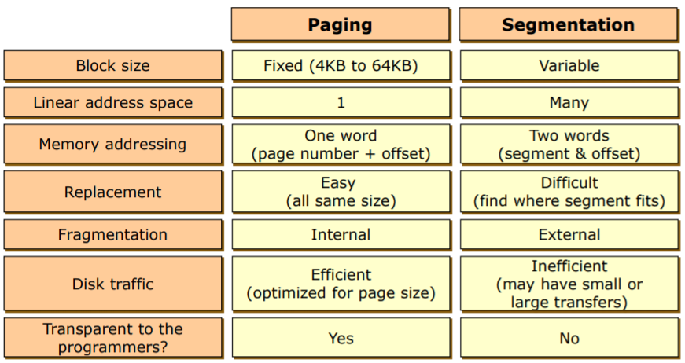
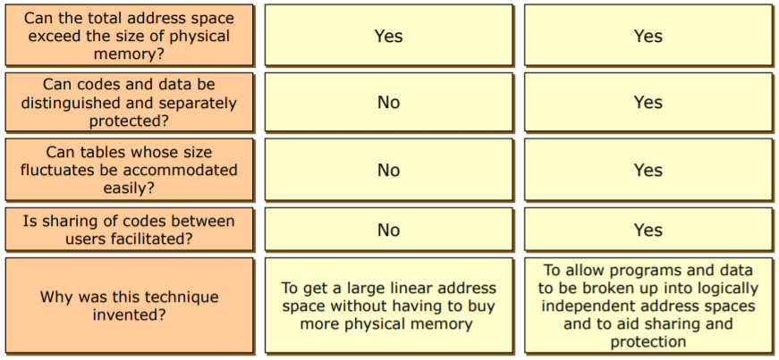

현시대에는 hybrid 형태를 많이 쓰며 대게 paging, segmentation with paging, paging with segmentation을 주로 사용한다.
