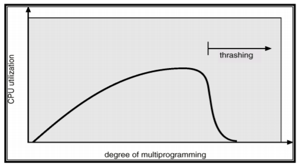

# Virtual Memory Management
- virtual memory: 실제 process에서 사용하는 memory 주소이다.
 이는 cpu의 연산을 단순화하고, 다양한 기능을 수행하는데 편리함을 준다. (9장에서 설명)

### page의 요청 단계

0. basic
  - 이때 해당 process는 당연히 waiting 상태로 들어간다고 보면된다.
  - CPU에서 보내는 logical address가 MMU에 들어가면, MMU는 Page Table에서 매핑되는 physical address를 얻는다.(해당 그림에는 존재하지 않음)
  - TLB Hit or Valid bit가 켜져있는 경우 이는 memory에 page에 mapping 되는 데이터가 존재한다는 것을 알 수 있다.
  - 따라서, 해당 physical address로 이동하여 데이터를 가져온다.
  - 만약 존재하지 않는 다음 과정을 거쳐서 page를 불러온다.
  - 해당 경우는 process가 page table에 process를 올렸지만, 해당 page가 table에서 사라졌을 때의 상황이다.
1. reference
  - pageTable에 page가 존재하는지를 확인한다.
  - PTE(page table의 한줄)에서 valid bit의 값이 i(0)이라면 해당 page가 현재 memory에 존재하지 않고 storage에 있다는 뜻이다.(= page fault)
  - 참고로 이 과정까지 TLB miss가 나고, 실제로 memory에 있는 page table에 접근해야 이 사실을 알 수 있다.
2. trap
  - 현재 memory에 page가 없음을 인지하면 OS에 trap을 건다.(software interrupt)
  - cpu는 현재 하던 모든 처리를 중지하고, OS의 Kernel의 page fault handler를 실행시킨다.
3. access storage
  - invalid가 되면서 page table에 자신의 storage 위치를 저장해둔 것을 따라서, storage에 존재하는 page를 찾는다.
4. get page from storage
  - storage의 page를 memory의 빈 공간으로 불러온다.
  - 만약, 빈 공간이 존재하지 않는다면, swapping이 발생한다.(memory에 있는 page중 하나를 storage로 swap out시키고 가져온 데이터를 swap in시킨다.)
  - 이때 swap out되는 PTE가 invalid가 된다.
  - 이때 어떤 frame의 page를 swap out시킬지에 대한 여러가지 algorithm이 존재한다.  
  바로 다음 주제임으로 그쪽을 살펴보자.
5. reset pageTable
  - page table entry에 swap in frame address와 valid 데이터를 update한다.
6. restart Instruction
  - waiting 상태의 process를 다시 ready queue에 삽입한다.

### page replace algorithm
- 가장 최적의 algorithm은 가장 page fault가 나지 않도록 swap out시키는 것이다.
- 즉, 다시는 요청하지 않을 page를 swap out시키는 것이 바람직하다.
- FIFO
  - 들어온 순으로 나간다.
  - 가장 간단한 방식의 구현이다.
  - 그렇게 좋은 방식이라고 볼 수 없다. 왜냐하면, 입력 순서는 고려할 수 있지만 빈도를 고려하지 못하기 때문에 자주 쓰더라도 일찍 들어왔다면 퇴출당하게 되서 효율적인 방식은 아니다.
- Optimal
  - process의 모든 page 요청 순서를 보고 이에 알맞게 자원을 할당한다.
  - 가장 늦게 나오는 page를 swap out 시키는 방식.
  - 이 방식이 가능하다면, 최선의 방식일 것이다.
  - 하지만, process가 항상 예상되로 진행되지는 않는다. 예외 상황이 너무 많기 때문에 오히려 성능 저하를 야기할 수 있다.
- LRU
  - Lest Recently Used 방식이다.
  - 가장 최근에 사용된 적이 없는 page를 제거하는 방식이다.
  - optimal 방식을 뒤로 진행했다고 보면된다.
  - 가장 이전에 사용된 page를 제거한다.
  - 이는 어느 정도는 빈도를 적용할 수 있지만, 완전하다고 할 수 없다.
  - 구현
     1. 사용된 시점을 PTE에 추가하는 방식. 이는 나중에 제거하여야할 데이터를 Search하는 비용과 추가적인 저장 공간이라는 비용이 발생한다.(timestamp)
     2. stack과 double linked list를 이용한다. 사용 방식은 stack의 일반적인 사용과는 다르다.
     가장 밑에 있는 page가 victim 후보이고 이미 있는 page가 요청되면 제일 위에 쌓는다는 점이다. 여기서 stack의 밑바닥을 빨리 빼기위해서 double linked 방식을 이용하는 것이다.
     3. timestamp같이 고비용 방식을 사용하지 말고, 최근에 참조되었으면 reference bits를 1증가시켜 PTE에 표시하는 방식이다. 이는 정확한 측정은 불가능하지만, 검색과 저장 비용을 확연히 줄여줄 수 있다.
     4. second Chance 방식이다. 이는 reference bit 하나만을 이용하는 방식으로 참조시마다 이를 1로 바꾸어준다. fifo 형태를 사용하면서 앞에서부터 하나씩을 빼는데 만약 reference bit가 1이라면 참조가 된적이 있다는 의미이므로 reference bit를 0으로 바꾸고 이를 fifo 맨 뒤로 다시 보낸다.
- NRU

  - 발전된 second Chance 방식으로 생각하면 좋다.
  - 만약 page에 데이터를 write했을 경우 추가적인 비용이 발생하는데 이러한 비용을 최소화하기 위해 이용한다.
  - 즉, 가장 만만한 victim은 합이 R과 M의 합이 가장 page이다.
  - Not Recently Used 방식이다.
- Counting 방식(aging 방식)
  - LFU(Least Frequently Used)
    - 모든 횟수를 세고 있다가 가장 적게 참조된 page를 탈락시킨다. 이는 최근이라는 정보를 포함하지 못해서 빗나갈 가능성이 높다.
  - MFU(Most Frequently Used)
    - 모든 횟수를 세고 있다가 가장 많이 참조된 page를 탈락시킨다. 많이 썼으니까 양보하라는 느낌? 이 또한 빗나갈 확률이 높아서 잘 쓰지 않는다.

### allocation of frame
- 특정 process가 얼마나 physical memory의 frame을 점유하도록 할 것인가에 대한 protocol이다.
1. Fixed Allocation
  - 고정된 크기만큼 할당받는 방식.
  - equal allocation: 모든 process가 동등하게 할당 받는다.
  - proportional allocation: process의 크기에 따라서 차등하게 할당 받는다.
2. Priority Allocation
  - 우선 순위가 존재하는 할당 방식.
  - page fault 발생 시에 해당 process의 우선 순위를 낮춘다.

### Thrashing
- page fault 확률이 높은 상태를 의미한다.
- 이러한 현상이 자주 발생할 때를 지켜보니, 실제로 수행 중인 process의 최소 page를 보장해주지 못할 때, 큰 page fault확률을 보여줌을 알 수 있다.

- 이로 인해 multiprogramming으로 늘어나야할 CPU성능이 Thrashing발생 부분부터 급감하는 것을 알 수 있따.
- 따라서, process당 최소한의 page 수를 맞춰주어야 한다.

### Thrashing 해결책
- Thrashing을 해결하기 위해서 최소한의 page를 지정하는 방식이 제일 일반적이다.
- 그 외에도 TLB의 크기를 아예 키워서 HIT날 확률을 높이는 것이 있다.  
이렇게 하면 매우 좋지만 TLB에 하나의 address line이 추가될 때마다 비용이 어마 무시하기 때문에 이는 쉽지 않다.

- 아래에서 = 연산을 모든 비트에 수행해야하는데 page갯수에 따라서 배수만큼의 = 연산용 and게이트가 발생한다.
