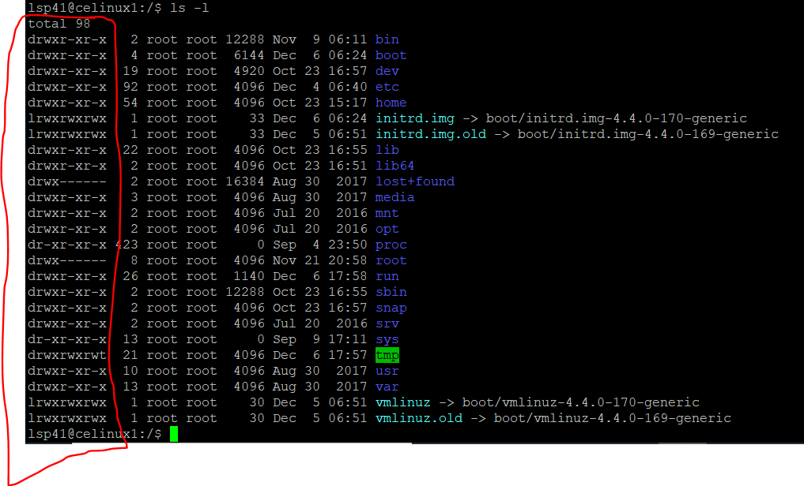

# File System.

### Storage
- 방대한 양의 데이터를 저장하는 공간.
- process가 사용 끝나고 종료된 후에도 살아있어야할 정보.
- 많은 process가 동시에 데이터에 접근이 가능하다.

### File System
- Definition
  - hardware인 storage를 추상화하여 구현한 것이다.(file)
  - 논리적으로 storage를 조직한다.(directory)
  - process, 사람 그리고 hardware간의 데이터 공유를 관리한다.(sharing)
  - 옳지 않은 접근으로 부터 데이터를 보호한다.(protection)
### File
- sequence of byte.
- storage에 저장되어있고, 이름 붙여진 관련된 정보의 모음.
- Attribute를 추가적으로 존재한다.
  - Protection이나 creater 등에 대한 정보를 저장한다.
- operation
  - 생성과 열기, 닫기, 쓰기, 읽기, 찾기, 권한 변경 등의 operation이 존재한다.
- type
  - text, library, source code, execution file 등 다양한 종류가 존재한다.
  - 크게는 위에서 설명한 일반 파일과 directory와 special file(IO입출력용 파일 등)로 나눈다.
- access 방식
  - index, record를 이용하는 등 여러 개의 접근법이 존재하지만, 일반적인 file system에서는  sequential acccess방식을 사용한다.
  - file의 읽은 위치를 기억하는 pointer를 두고 읽기 또는 쓰기를 수행할 때마다, 파일의 끝을 향해 나가는 방식이다.
  - rewind와 같은 방식으로 access를 이전으로 돌릴 수 있다.

### Directory
- definition
  - list of file names & file attributes.
  - 사용자 입장을 고려하여 구조화된 파일 집합을 제공하는 형태이다.
  - file system을 구획하고 파일들을 서로 구분하고 분리해난다.
  - UNIX/LINUX는 file로 보고 해당 과정을 수행할 수 있다.   
- operation
  - 기본적으로 file의 연산과 비슷한 방식이다.
  - 열고 닫기, 쓰기, 읽기, 찾기 등을 지원한다.
- architecture
  - level을 여러 개 만드는 방식을 선택하다가 보니 자연스럽게 tree 구조를 선택하게 되었다.
  - 여기서 tree 구조를 선택해서 cycle을 만들지 않는 이유는 cycle을 만들게 되면 참조하는 다른 directory file도 수정해야 하는데 이로 인한 비용과 복잡한 구조를 야기하기 때문에 이를 막는다. (대신 바로가기와 같은 기능으로 위치를 참조하는 방식은 사용할 수 있다.(linking))
- path Name
  - file의 경로는 /(구분자)를 통해서 구분하여 나타낸다.
  - tree에서 root에 해당하는 / directory부터 해당 directory안의 어떤 file을 가르킬 수 있다.
  - ex. "/home/ubuntu/www/ROOT/index.html"

### Mount
- 서로 다른 file system을 연결하는 과정이다.
- 이때 붙임을 받는 system은 빈 directory에 새로운 file system의 root directory를 연결한다.

### File Sharing
- 같은 hardware를 사용하는 다른 유저간에, network로 연결된 상황에서 hardware간에는 file을 공유하는 file sharing 정책을 사용한다. 이때 반드시 protection 방식을 보장해야 한다.
- protection
  - file에 대한 접근을 제어한다.
  - 누가 / 무엇을 으로 나뉜다.

  - 위 사진을 봤을 때 빨간색으로 표시한 부분이 file의 attributes라고 할 수 있다.
  - 맨 앞에 있는 character의 의미는 file의 type 즉, d = directory / - = file / l = link file 을 의미한다.
  - 그 뒤에 나오는 3개의 character는 생성자의 권한이다. rwx는 각각 read /write /execution을 의미한다. -은 권한이 없다는 뜻이다.
  - 그 뒤에 나오는 3개는 생성자가 속한 그룹 인원들의 권한이다.
  - 그 뒤에는 해당 node의 모든 사용자에 대한 권한이다.

  
