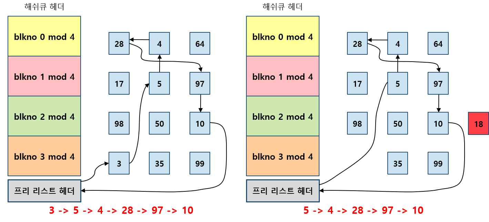

# Implement File System.

### Structure
- Disk Structure

  - Master Boot Record
    - OS가 booting시에 POST(Power On Self Test)를 마치고,
    storage에 처음 호출하는 부분이다.
    - booting error에 대한 정보를 포함하는 master boot code와 각 partition에 대한 정보를 담는 table이 존재한다.
  - Partition
    - 하나당 Local Disk라고 생각하는게 좋다.
    - boot block : Booting에 대한 정보를 담는다.
    - super block : 해당 partition의 metadata를 저장한다.  type, #blocks, etc..
    - bitmaps : free space를 위한 자료구조이다.
    - i-nodes : file에 대한 metadata를 저장한다.
    - root dir : root directory가 담긴다.
    - files & Directory : 실제 file과 directory가 저장된 공간.

- Memory Structure

- Memory에서는 각 process는 해당 process가 다루는 file에 대한 정보를 담은 table이 존재한다.
- 또한, 모든 process의 file 정보를 보관하고 있는 file table이 존재하며 이는 OS의 Kernel에서 직접 관리한다.

### VFS
- Virtual File System.
- 추상화에 가까운 개념이다.
- 여러가지 file system들이 등장하면서 운영체제 마다 file system을 다루는 protocol을 모두 저장하기에는 비용이 너무 커지면서 등장한 개념이다.
- file system마다 공통되는 부분을 interface로 묶어 놓고 중복되는 부분은 다시 저장하는 일이 없도록 구현한 형태이다.

### Directory
- directory는 file list와 같다.
- 구조
  - file name + file's info(permission, size, owner, etc)
- file name 저장 방식
  - 단순 list 방식
  - hash table 방식
- file info 저장 방식
  - file name과 함께 저장
  - file name list에 mapping되는 형태로 따로 구성하기
  - 반반 섞어서 쓰기(info의 성질에 따라 다르게 분리)

### Allocation
- partition에 실제로 file이 저장되는 영역에 할당하는 방식이다.

1. Contiguous Allocation
  - 시작점과 길이만 갖고 모든 걸 표현한다.
  - random access가 가능하고 빠르게 찾을 수 있다.
  - 구현이 쉽다.
  - 하지만, 공간 낭비가 심하고(extra fragmentation), file의 크기를 늘릴 수 없다.
  - 따라서, file이 한 번 쓰이고 변경되지 않는다면, 사용할 수 있다.

  

2. Linked Allocation
  - 각 block들이 file영역 아무대나 흩뿌려져있다.
  - starting address만 갖고 block을 찾는다.
  - 공간 낭비가 없고, 수정이 용이하다.
  - 단, 접근속도가 굉장히 느리고, pointer 유지에 더 많은 overhead가 생길 수 있으며 중간에 pointer가 끊기면 뒤에 있던 데이터는 모두 날라간다.

  

3. Indexed Allocation
  - 가르키는 block에 모든 pointer를 저장하는 방식이다.
  - 추가적인 index table이 필요하다.
  - 임의 접근이 가능하여 access 속도가 빠르다.
  - 공간 낭비가 없다.
  - 하지만, 공간 낭비는 막을 수 없고, 사이즈에 제한이 발생하게 된다.
  - 이를 해결하기 위해 두 겹 세겹의 indexed table을 겹쳐서 해결한다.(두번째 그림)
  
  

- free-space management
  - 빈 공간을 효율적으로 관리하기 위해서 모든 빈 공간을 link로 연결하고 있는다.

### Total

### Buffer Cache
- file을 읽고 쓰는 과정을 효율적으로 수행하기 위해 memory에 disk에 대한 capture를 저장하고 있는다.
- Write
  - write는 항시 발생하는 것이 아니라 memory에 빈공간이 필요로 될 때, 한 번에 flush된다.
- Read
  - data의 read는 locality를 고려하여 caching 된다.
    - spatial locality : 요청한 데이터 근처의 데이터를 요청할 가능성이 높다.
    - temporal locality : 요청한 데이터는 다시 요청할 가능성이 높다.
- architecture
  - block을 불러올 때, 중간에서 cache 역할을 한다.

- buffer header
  - buffer header는 hashQueue와 freeList의 pointer를 갖고있는다.
  

- free list
  - 사용이 다 끝난 것을 free List에 연결하여 관리한다.
  - double linked list로 구현한다.

- hash queue
  - hash queue에 hash module을 적용한 모든 buffer를 모두 연결한다.

- getBlock
  - getBlock은 buffer Cache의 핵심 로직이다. 이를 이해하는 것이 buffer cache를 이해하는 핵심이다.
  - getBlock을 통해 file block을 불러온다.
  - 시나리오가 5개 존재한다.
    - senario 1
      - freeList에 buffer 내용이 있다면, 이 block을 가져온다.
    

    - senario 2
      - freeList에도 hashQueue에도 없으면, freeList에서 맨 첫번째 buffer를 꺼내서 block을 할당한다.
    

    - senario 3
      - 만약, freeList 중에 Delay가 있다면, delay를 write 시키고, freeList에서 제거한다.
    

    - senario 4
      - freeList에 아무것도 존재하지 않는다면, free Buffer가 생길 때까지, sleep한다.
    

    - senario 5
      - 요청하는 block이 busy상태라면, 마무리될 때까지 sleep한다.
    

- read
  1. buffer에 block이 있는 경우
  

  2. buffer에 block이 없는 경우
  

  3. 두 개 이상의 요청을 수행할 경우
  

- write
  1. 동기적 write
  

  2. 비동기전 write
  

  3. write back
  
