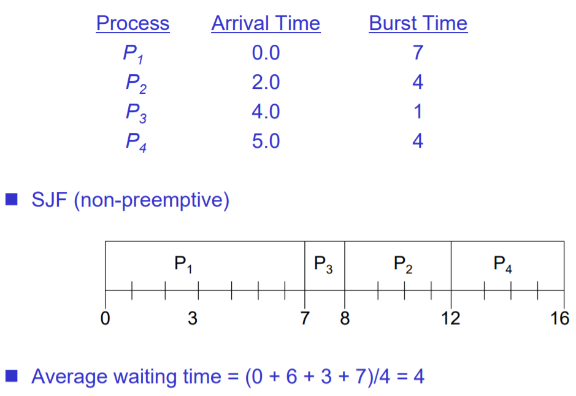

# Process scheduling
process 수행을 위해 memory 또는 storage의 process를 ready queue에 올리고,  
이를 CPU에 할당하는 작업.

### 용어 정리

##### CPU burst
- CPU burst란, CPU를 사용하고 있는가를 나타낸다.
- CPU를 효율적으로 쓰고 있다는 것은 CPU가 쉬지않고 돌아가고 있다는 뜻이다(whenever burst).
- 그런데 IO process와 같은 경우 사람의 입력은 컴퓨터의 속도에 매우 못미치기 때문에,  
CPU burst가 매우 적게 이루어진다.(사람이 입력하는 동안 쉬어야됨.)
  

##### Dispatcher
- context switching을 담당한다.
- user mode에서 process를 돌리다가, 이를 저장하고,  
새로운 process를 불러오고 다시 usermode로 돌아가서 이를 무한 반복한다.
- 즉, CPU에 대한 control을 전달한다.

##### Pre-emtive
- 선점한다는 뜻이다.
- 즉, Scheduling을 할 때, Pre-emtive한 process가 온다면 이는 제어권을 마음대로 사용할 수 있고,  
non pre-emptive인 경우 제어권을 함부로 뺏어오는 것이 불가능하다.(interrupt가 불가능하다.)
- non pre-emptive는 Dispatcher가 수행할 수 없도록 block된 상태를 말한다.

### Scheduler의 기준
- CPU 활용성
- Throughput : 처리 효율
- Turnaround time : 총 시간
- Wating time : 대기 시간
- Response time : 입력을 받고 응답을 보내는 시간. (output을 내는 것이 아님.)

### Scheduler의 Goal
- All system
  - 공정한 process 작업 수행.
  - 시스템이 매우 바쁘더라도 balancing있는 작업 할당.
    - Starvation한 경우를 예방해야한다.(priority scheduling 시에는 굶주릴 수록 우선순위를 올려해결한다.)
  - 평균 대기 시간을 최소화해야한다. (= 실행시간이 짧은 작업부터 실행해야 한다.)
- Batch system
  - 처리할 수 있는 작업의 수는 최대화
  - 전체 수행시간은 최소화
  - 항상 CPU burst 상태 유지시키기.
- Interactive system
  - 반응 시간 최소화
  - 대기 시간 최소화
  - 유저의 바람대로 이루어저야만 한다.
- Real time system
  - deadline안에 작업이 끝나야한다.
  - 속도가 저하되는 것을 피해야 한다.

### Scheduling Type
##### 1. FCFS(First Come, First Served)
- 자료구조 queue의 형태를 그대로 이용하여 process를 온 순서대로 작업을 배치한다.
- 전형적으로 non-preemptive한 형태이다.
- 모든 process는 동등하게 다루어져서 starvation이 없다.

BUT,
- Average Waiting time은 엄청나게 길어진다. (짧은 작업이 긴작업보다 뒤에 오기 때문이다.)
- 효율적으로 IO와 CPU처리를 배분하지 못한다.
  
  

##### 2. SJF(Shortest Job First)
- CPU burst가 작은 순으로 process를 scheduling한다.
- 최선의 average waiting time을 기대할 수 있다.
- 이 또한, 전형적인 non-preemptive하다.(한 작업이 끝나야 다음 할당을 계획한다.)

BUT,
- 미래의 CPU burst의 양을 아는 것은 불가능하다.
- 잠재적으로 굶주리는 process가 발생한다.(작업시간이 긴 친구들)
  
  

##### 3. SRTF(Shortest Remaining Time First)
- SJF와 concept는 동일하다.
- preemptive하게 process를 할당한다.
- 매순간마다 제일 짧은 process가 할당된다.
  
  

##### 4. Priority Scheduling
- 우선순위를 어디에 두냐에 따라 여러가지 형태의 scheduling이 가능하다.
- SJF도 일종의 priority scheduling 방버이다.(priority : average waiting time)
- priority의 starvation 해결법은 aging이다.
- 할당되지 않을 때마다 age라는 변수의 값이 커지며 우선순위가 점점 증가하게 하는 방식이다.

##### 5. RR(Round Robin)
- 각 process의 최대 CPU burst time을 지정하여 해당시간이 지나면 바로 context switching을 수해한다.
- 여기서 최대 CPU burst time(quantum time)을 무한대로 하면, FCFS와 동일하다.
- 이 방식을 수행하게 되면 우선 순위없이 모든 process가 동등하게 취급받을 수 있다.
- 따라서, response time은 상당히 향상되는 것을 볼 수 있다.

BUT,
- context switching으로 인한 overhead가 급증한다.
  
  

##### 6. Combining Algorithm
- 단계를 나누어 단계마다 다른 scheduling 방식을 취한다.
- 매 상황마다 효율적인 scheduling 방식을 채택한다.  
ex. foreground - RR / background - FCFS

##### 7. FeedBack Queue
- aging 기법을 활용한다.
- 매 scheduling마다 feedback을 실시하고, 결과가 만족스럽지 못하다면 더 극단적인 scheduling방식을 취하거나,  
더 안전한 scheduling을 고르는 방식.  
ex. first scheduling quantum = 8 / second scheduling quantum = 16 / End scheduling quantum = infinite

##### 8. RMA(Rate Monitoric Algorithm)
- RealTime scheduling에 가장 근본이되는 방식이다.
  - 얼마나 마감시간에 엄격하냐에 따라 두개로 나뉘어진다. (Hard realtime, Soft RealTime)
  - 여기서는 Hard realtime을 target으로 한다.
  - 예측성을 갖고 효율적으로 scheduling을 수행해야 한다.
  - 실시간으로 내/외부를 계속 모니터링 하기 때문에 엄청나게 많은 데이터를 처리해야 한다.
  - 이 system에서는 주기적인 입력이 "주"가 된다.
- 마감시간 내에 job을 끝내는 것에 가장 큰 관심사를 갖고있다.
- scheduling 시에 주기가 짧은 순으로 task를 할당한다.
  
  

- Task의 정보
  - task 1
    - 주기(T1) : 5
    - CPU burst(C1) : 1
  - task 2
    - T2 : 10
    - C2 : 2
  - task 3
    - T3 : 15
    - C3 : 5
  - Scheduling 단위(Hyper Period)는 모든 주기의 최소공배수로한다. (그 이후는 배수 단위로 동일함.)
  - RMA의 Scheduling 가능여부 판단

  
  
    다음과 같이 진행하다보면 우항의 값이 무한대로 갈수록 ln2(0.693)에 수렴한다.  
    여기서 util을 구하는 방식이 하나 더 있는데 U = Hyper Period - slack 이다.  
    따라서, util이 의미하는 것은 얼마나 CPU를 효율적으로 사용했는가를 의미한다.

- Aperiodic task가 들어올 때, RMA는 어떻게 스케쥴링할 것인가 라는 문제가 있다.

##### 8-1. Background
- Aperiodic task가 들어오면 이를 저장해두고 있다가 모든 주기적 task가 끝났을 때, 이것을 할당한다.

##### 8-2. Polling
- polling이 의미하는 것이 주기적으로 물어보는 것이다.
- polling이라는 주기적 task를 하나 있다고 가정한다.
- 그리고 해당 주기마다 Aperiodic task가 존재한다면, polling 시기에 해당 작업을 처리한다.

##### 8-3. Deferrable
- 항상 Aperiodic task가 일순위이다.
- Apreodic task를 처리할 수 있다면, 바로바로 서비스를 실행한다.
- 한 주기마다 처리할 수 있는 Task의 양이 정해져있어 한계가 있다.

##### 9. EDF(Earlist Deadline First)
- 마감시간이 가까운 순으로 scheduling을 실시한다.
