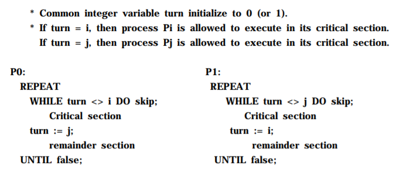
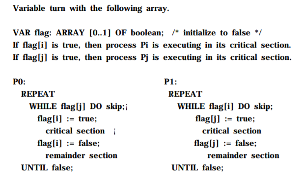
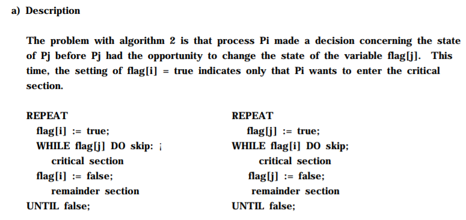
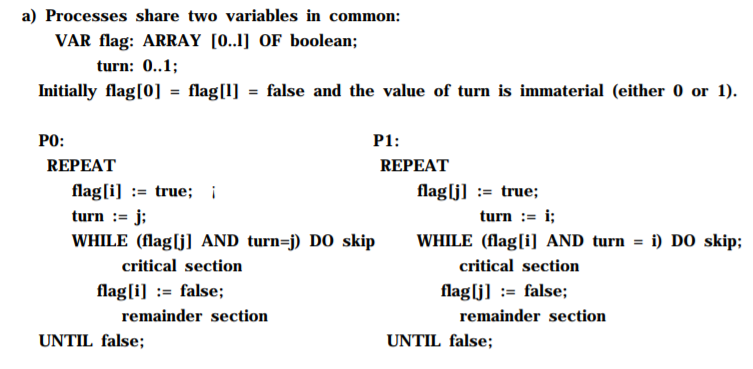

# Synchronization(1)

##### 용어 정의
- Critical Section : 두 개의 process가 공유하는 data 영역이다.
- Data Dependency : 이전 instruction에 의한 data 처리가 현재 instruction에 영향을 미치는 현상이다.
  - critical section에서는 이러한 data Dependency가 필수적으로 발생한다.
  - 첫 째로, pipelining에 의한 현상이다.(RAW)
  - 둘 째로, Multiprocessing에 의한 현상이다.(WAW, WAR)
  - instruction의 처리를 동시에 수행하거나, 번갈아가면서 수행된다.
  - 이때 데이터 처리는 단계가 나뉘어 수행되기 때문에 문제가 발생한다.


### Concurrency
- process가 작업을 수행함에 있어, 일관성있는 작업의 수행은 매우 중요하다.
- 각 process마다 공공재를 사용할 때, 서로 약속을 정해두지 않고 사용하면 문제가 발생한다.
- 제일 쉬운 예시가 공중 화장실로 볼 수 있다.
  - 공중 화장실 한 칸을 여러 사람이 공유한다.
  - 이때, 한 명이 들어가면 다른 사람이 들어가면 안된다는 것이 규칙이다.
  - 이를 어기고 동시에 접근하여 사용하게 되면 문제가 발생한다.
  - 만약 데이터를 쓰기 전에 읽거나, 쓰거나, 읽기전에 쓰게 되면 데이터의 일관성을 유지할 수 없다.(logical error)
- 따라서, 데이터를 일관성있게 사용하기 위해서는 사용 중인 process가 있다면, 이를 아무도 접근하지 못하게 막아야한다.(동기화, 상호배제)


### Mutual exclusion(상호 배제)
- 상호 배제가 없다면, process간의 context switching과정에서 logical error가 발생한다.
- process간의 mutual exclusion은 필수적이다.
- 상호 배제의 3조건이 있다.

##### Condition
- 1. Critical section에는 한 번에 반드시 하나의 process만 있어야 한다.(Mutual Exclusion)
- 2. Critical section이 비어있고 이를 필요로 하는 process가 있다면 해당 process는 들어갈 수 있어야 한다.(progress)
- 3. critical section을 기다리는 process는 유한 시간 내에 반드시 들어가야 한다.(Bounded Waiting)


- 상호 배제를 구현하는 방법은 4가지가 존재한다.

##### 1. Software
- application단 에서 직접 mutual exclusion을 구현하는 방법이다.
- 장점
  - 직접 만드니 전문적이고 효율적 사용이 가능하다.(군더더기 없다.)
- 단점
  - 직접 만든 사람이 아니면 사용이 어렵고, 모든 과정에서 융통성 있게 사용할 수 없다.
  - 만드는 과정 역시 어렵다.


- basic implementation
- 전제
  - 2개의 process를 대상으로 한다.
  - 2개의 process는 병렬적으로 수행된다.
  - ( <> == != )
  - ( skip == Do nothing )

- Algorithm(1)


  - i와 j가 번갈아가면서 수행한다.
  - 이 방식은 예를 들자면, 문이 두 개인 화장실 칸에 잠금 장치가 없을 때, 번갈아가면서 사용하는 방식이다.
  - 이 방식의 문제점은 반드시 번갈아가면서 작업을 수행하야 한다는 것이다. 즉, 화장실이 가고 싶은데 상대가 쓴 적이 없다면 들어갈 수 없는 것이다.
  (condition 2, 3에 위배된다.(progress & bounded wait))

- Algorithm(2)


  - process하나가 critical section으로 들어가는 잠금 장치를 넘어 들어왔다면, 다른 process의 진입을 막는 방식이다.
  - 화장실 안에 들어와서 상대방의 문을 잠그는 방식이다.
  - 이 방식의 문제점은 둘이 거의 동시에 들어왔을 때의 문제이다.
  - 잠금장치를 잠그기 전에 두 process가 들어왔다면, critical section에 2개의 process가 존재하게 된다.
  (condition 1에 위배된다.(Mutual Excution))

- Algorithm(3)


  - 이 방식은 critical section으로 들어가는 잠금 장치를 들어가기 전에 상대의 진입을 막는 방식이다.
  - 화장실 안에 들어가기 전에 상대방의 문을 잠그는 방식이다.
  - 이 방식의 문제점은 둘이 서로의 문을 잠가서 아무도 못들어 갈 때이다.(deadlock)
  (condition 2, 3에 위배된다.)

- Algorithm(4) - [peterson Algorithm]

- Algorithm(3)와 Algorithm(1)을 합친 방식이다.
- 다른 process의 접근을 막고, turn을 상대 턴으로 만들어준다.
- 그리고 상대가 잠겨있거나 내 차례라면 들어간다.
- 이것이 해결할 수 있는 문제는 둘다 잠겨있을 때, 반드시 차례는 반대로 되어있다는 것이다.
- 차례가 안 바뀔 때는, 상대가 막혀있으므로 들어갈 수 있다.
(condition을 모두 만족했다.)


##### 2. Hadrdware
- 하드웨어적 설계를 통해 critical section의 입장과 lock 동작 사이에 interrupt가 발생하지 않도록 하는 방법이다.
- 장점
  - Hadrdware단 에서 처리하기 때문에 매우 빠르다.
- 단점
  - 이 또한, 융통성이 없고, 확장성이 없다.

##### 3. Semaphore
- low level language를 이용하여 Software적으로 해결한다.
- 이는 semaphore라는 변수를 이용하여 해당 변수를 제어하는 동안 아무도 다른 process를 수행하지 않도록, compiler가 동작을 지시한다. 이를 통해서 semaphore를 사용한 함수에서는 atomic한 성질을 갖게 되어 함수가 동작하는 동안에는 context switch가 발생하지 않는다.
- 함수는 일반적으로는 2개가 있다.
  - Wait(P(s)) : s(semaphore)가 0 보다 클 때까지 기다린다. 만약, 0보다 크다면 -1하고 그 뒤를 진행한다. 이 두 과정이 사이에서 절대로 context switching이 발생하지 않는다.
  - Signal(V(s)) : s(semaphore)의 값을 1 증가 시킨다.
- 장점
  - 매우 powerful하면서 확장성있고 빠르다.
- 단점
  - 사전의 compiler에서 처리를 수행해주어야 한다.
  - 잘못 사용하면 deadlock을 발생시킬 수 있다.<br>
  
- 이를 통해서 모든 다양한 형태의 concurrent process를 처리할 수 있다.

  ex)
  

  ```
  BEGIN
    a,b,c,d,e,f,g = 0
    PARBEGIN
      BEGIN S1 V(a) V(b) END
      BEGIN P(a) S2 S4 V(c) V(d) END
      BEGIN P(b) S3 V(e) END
      BEGIN P(c) S5 V(f) END
      BEGIN P(d) P(e) S6 V(g) END
      BEGIN P(f) P(g) S7 END
    PAREND
  END
  ```
 - 화살표를 쏠 때는 signal이고, 기다릴 때는 wait라고 생각하면 다음 식을 쓰기 매우 편리하다.(binary semaphore)
 - 이러한 방식의 semaphore 사용은 병렬 수행하는 process간의 concurrency를 확보할 수 있었다.
 - 하지만, condition이 포함되는 critical section의 문제를 해결하지는 못했다.
 - 이에 대한 해결책은 다음 장에 계속....
