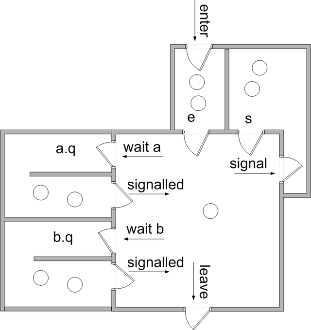

# Synchronization(2)

##### 4. Monitor
- 상위 level의 구조체형태를 이용하여 상호 배제를 구현한 방식이다.
  
- 다음 그림에서 제일 큰 방(critical Section)에는 단 하나의 process만 존재하도록 하는 것이 monitor방식이다.
- 구조
  - 총 3 종류의 buffer를 갖는다.
    - entry queue : Body의 mutual exclusion을 보장하는 queue로 처음 process가 접근할 때는 이를 통해 입장한다.(body의 mutual exclusion을 보장한다.)
    - next queue : condition queue에 있던 process가 진입할 때, 이미 들어와있던 process의 데이터를 저장하는 queue이다. 이것이 존재하는 이유는 이미 진행 중이였던 작업을 보존하면서, 처리 중이던 작업이 우선 순위 맨 뒤로 밀려나는 것을 막기 위함이다.
    - condition queue : monitor body에 입장했다가 조건이 맞지않아 monitor body에서 나가서 해당 queue에 저장된다. 이 조건이 맞을 때까지 기다리다가 이를 만족하면 critical section으로 진입한다.(process간의 synchronization을 보장한다.)
  - monitor Body
    - 모든 process가 작업을 수행할 공간이다.
    - 이 공간은 critical section으로 한 process가 이 안에서 작업을 수행하고 있을 때 다른 process는 접근할 수 없다.
  - 나머지
    - 나머지는 구조체의 일반적인 형태이다. 생성자와 변수 선언 등.
- 아주 기본적인 형태만 자바 코드로 표현하자면 다음과 같다. (circular queue를 이용하여 데이터를 넣고 뺀다. 이 과정에서 append와 take가 monitor 내부에서 발생하고 있다면 다른 process는 이 안에 접근할 수 없도록 보호하는 기능을 수행한다.)
```java
public class monitor {
  private int in;
  private int out;
  private int num;
  private int max;
  private int [] buffer;

  public monitor (int MAX) {
    max = MAX;
    buffer = new int [max];
    in = 0;
    out = 0;
    num = 0;
  }

  public void append(int value) {
    while (num >= size) {
      continue;
    }
    buffer[in] = value;
    in = (in + 1) % max;
    num++;
  }

  public int take() {
    while (num <= 0) {
      continue;
    }
    int value = buffer[out];
    out = (out + 1) % max;
    num--;
  }
}
public class app {
  public static void main(String args[]) {
    thread producer = new thread(produce);
    thread consumer = new thread(consume);
    // 병렬 수행.
    producer.start(1);
    consumer.start();
  }

  private void produce (Object val) {
    int value = (int)val;
    while(true){
      System.out.println("Producer produce :" + value);
      append(value);
    }
  }

  private void consume () {
    while(true){
      System.out.println("Consumer consume : " + take());
    }
  }
}
```

- 위와 같이 monitor를 구현하게 되면 문제가 발생하게 된다.
- condition queue를 제어할 방법이 존재하지 않아서 꽉찼을 때 append하거나 비었을 때 take를 했을 때 대처할 수 있는 방법이 없다.
- 이를 해결하기 위한 방법이 semaphore를 통한 monitor의 구현이다.
  - 필요한 semaphore
    - 1. mutex <br>
     monitor body의 mutual execlusion 제어
    - 2. x.sem<br>
    각 조건에 의해서 제외된 process간의 synchronization을 보장하기 위함.
    (x는 조건 하나를 의미하고 program에 따라 조건의 수만큼 늘어난다고 생각하면 된다.)
    - 3. next <br>
    next queue안의 process를 제어한다.
    - 4. x.count<br>
    (x.sem과 동일.)
    - 5. next.count

- 다음과 같이 semaphore 7개를 이용하여 synchronization을 보장하는 produce, consume 관계를 만들 수 있다.
- 직접 구현한 거라서 오류 있으면 말해주세요....
```
BEGIN
  mutex = 1;
  x_sem, x_count, y_sem, y_count, next_sem, next_count = 0;
  PARBEGIN
    BEGIN append END
    BEGIN next END
    BEGIN task END
  PAREND
END
/*-------------------------------------------------------------------------------*/
PROCEDURE append
  BEGIN
    P(mutex);
    IF num > size THEN
      BEGIN
        x_count := x_count + 1;
        V(mutex);
        P(x_sem);
        next-count := next_count + 1;
      END
    buffer[in] = data;
    in = (in + 1) % size;
    num++;
    IF y_count > 0 THEN V(y_sem);
                   ELSE IF next_count > 0 THEN V(next_sem);
                                          ELSE V(mutex);
  END
/*-------------------------------------------------------------------------------*/
PROCEDURE next
  BEGIN
    P(next_sem);
    IF x_count > 0 THEN
    BEGIN
      buffer[in] = data;
      in = (in+1) % size;
      num++;
      IF y_count > 0 THEN V(y_sem);
                     ELSE IF next_count > 0 THEN V(next_sem);
                     ELSE V(mutex);
    END
                   ELSE
    BEGIN
      data = buffer[out];
      out = (out + 1) % size;
      num--;
      IF x_count > 0 THEN V(x_sem);
                     ELSE IF next_count > 0 THEN V(next_sem);
                                            ELSE V(mutex);
    END
  END
/*-------------------------------------------------------------------------------*/
PROCEDURE take
  BEGIN
    P(mutex);
    IF num <= 0 THEN
      BEGIN
        y_count := y_count + 1;
        V(mutex);
        P(y_sem);
        next-count := next_count + 1;
      END
    data = buffer[out];
    out = (out + 1) % size;
    num--;
    IF x_count > 0 THEN V(x_sem);
                   ELSE IF next_count > 0 THEN V(next_sem);
                                          ELSE V(mutex);
  END
```
